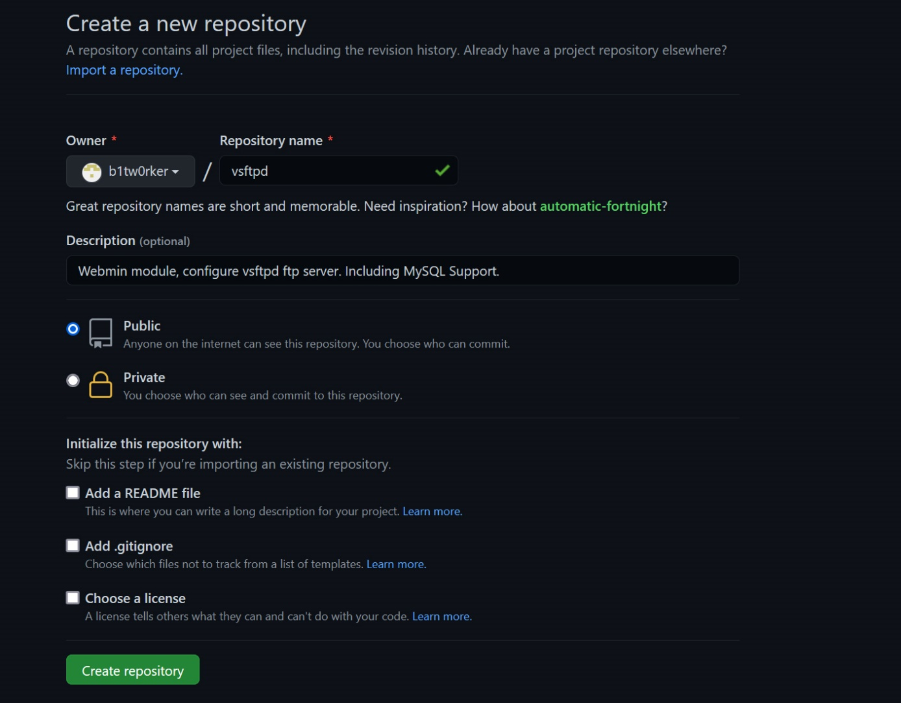

# Ein existierendes Projekt nach Github migrieren

Ein neues Repository auf github.com erstellen. Nicht README, license
oder .gitignore initialisieren (Siehe Bild)




**Achtung:** github liefert nach Erstellung eine Anleitung mit ‚main'
als branch. Wir wollen aber ‚master' als branch. Entsprechend ist das
Script angepasst.

```bash
cd /lokales/projektverzeichnis
```

```bash
$ echo "# vsftpd" >> README.md
$ git init
$ git add README.md
$ git commit -m "first commit"
$ git branch -M master
$ git remote add origin https://github.com/b1tw0rker/name-des-repository.git
$ git push -u origin master
```


Em Ende fragt github.com nach Usernamen und Password, falls es nicht im
askpass verfügbar ist.

{width="6.3in" height="2.3743055555555554in"}

### git.sh
Mit diesem kleinen Script kannst du Änderungen automatisch nach
github.com auschecken.


```bash
$ cd /dein/loklaer/projektordner
$ git add *
$ git commit -m "initial version"
$ git push origin master
$ exit 0
```

Füge in .gitignore ‚git.sh' zu, damit die Datei nicht mit ins Repository
ausgecheckt wird.


Wenn das Passwort nicht erneut eingegeben werden soll, kann das mit
folgendem Befehl gelöst werden:


```bash
$ git config credential.helper store
# Noisy Warnmeldung loswerden
$ git config advice.addIgnoredFile false
```


Git wird die benötigten Passwörter aus dem loklane, globalen Cache
holen.

### Tipp:
Um Word Dateien nach Markdown zu konvertieren, nutze: ‚pandoc‘ 
( https://christiantietze.de/posts/2019/07/convert-docx-to-markdown/ )


```bash
$ pandoc -o output.md --extract-media=./ inputfile.docx
```


### License
[MIT](https://choosealicense.com/licenses/mit/)